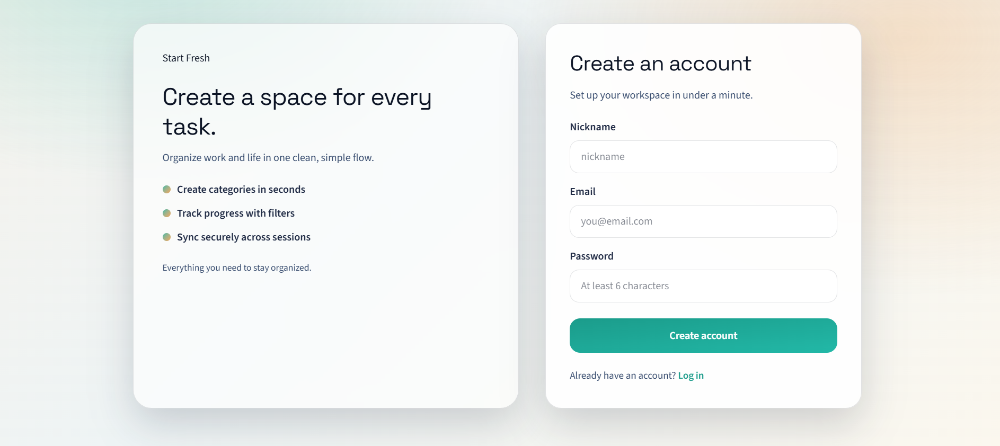
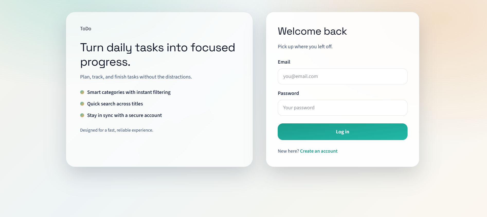
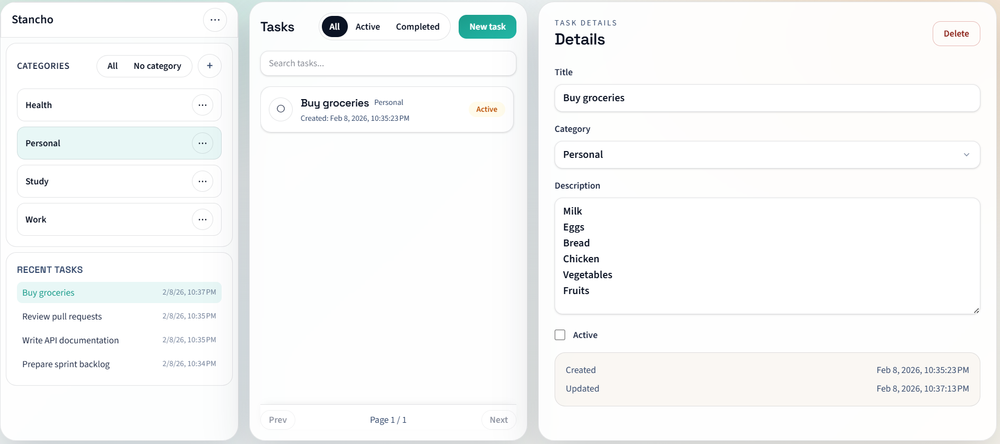
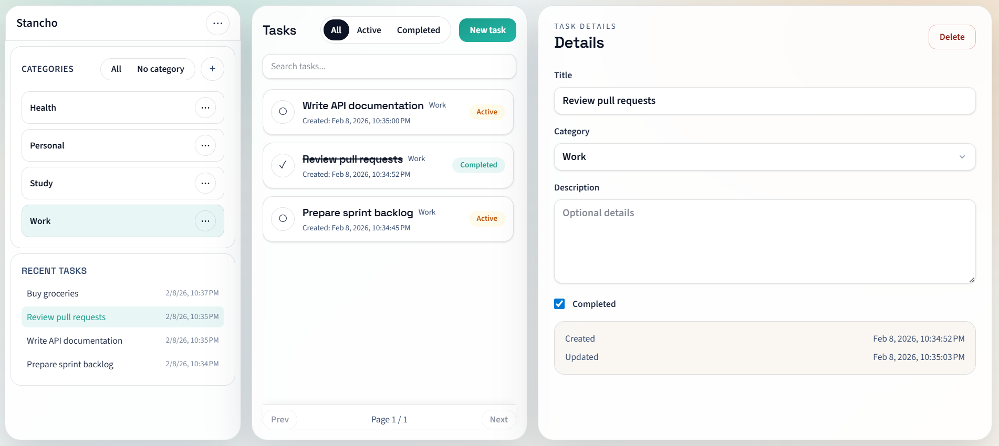
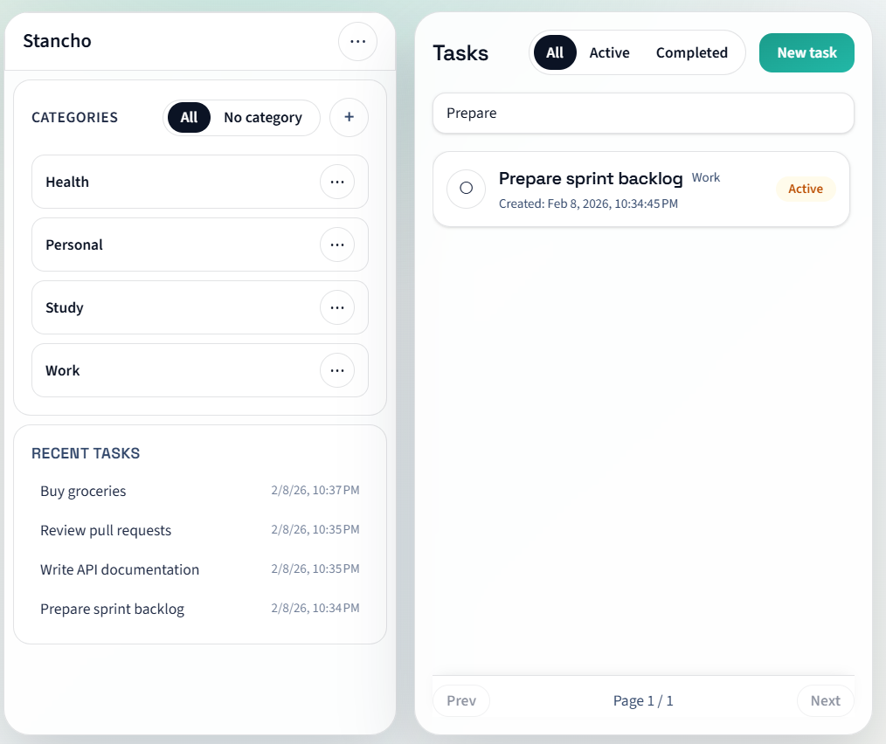
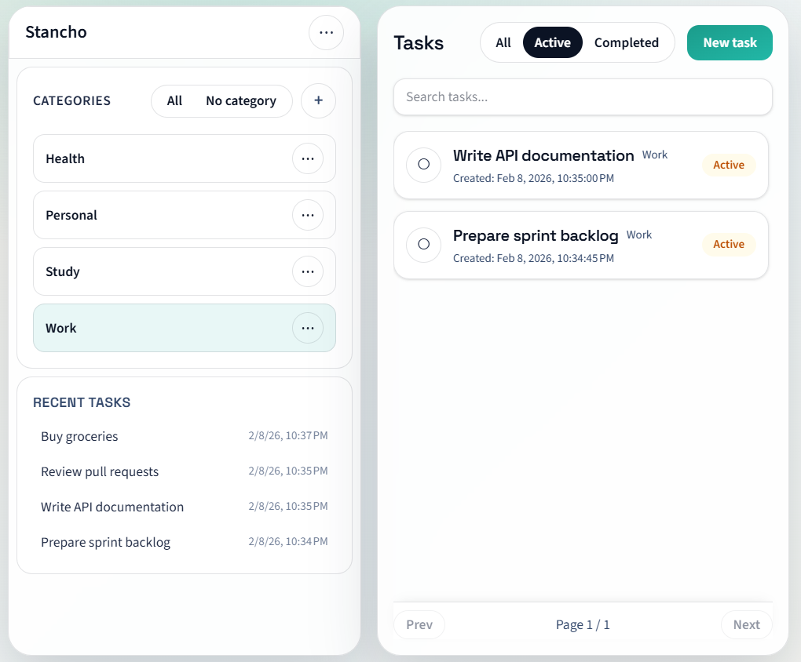

# ToDoApp

Fullstack To-Do application with authentication, categories, and task management.  
Built as a learning + portfolio project using ASP.NET Core and Angular.

---

## ✨ Features

- User registration & login (JWT + refresh tokens)
- Secure authentication with access / refresh tokens
- Task management (create, update, complete, delete)
- Categories with searching and filtering
- Recent tasks overview for quick access to latest activity
- Pagination for task lists

---

## 📸 Screenshots

### Login & Registration



### Tasks Dashboard



### Searching & Filtering



---

## 🛠 Tech Stack

#### Configuration

Before running the backend, create your local configuration file:

1. Copy `appsettings.Development.json.example`
2. Rename it to `appsettings.Development.json`
3. Update the following values:
    - Database connection string
    - JWT settings

### Backend
- ASP.NET Core
- Entity Framework Core
- SQL Server
- JWT Authentication
- REST API

### Frontend
- Angular
- TypeScript
- RxJS
- Tailwind CSS
- Standalone components
- HTTP interceptors & guards

## 🚀 Getting Started

### Backend

```bash
cd TodoApp/TodoApp
dotnet ef database update
dotnet run
```
Backend will start on:
https://localhost:7115

### Frontend
```bash
cd TodoApp.Client
npm install
ng serve
```
Frontend will be available at: http://localhost:4200

## Project Structure

```
ToDoApp/
│
├── TodoApp/ # ASP.NET Core backend
│ ├── Controllers
│ ├── Services
│ ├── Interfaces
│ ├── Data
│ │ ├── Entities
│ │ └── AppDbContext.cs
│ ├── DTOs
│ ├── Middleware
│ └── Program.cs
│
└── TodoApp.Client/ # Angular frontend
├── src/
│ ├── app/
│ │ ├── auth/
│ │ ├── core/
│ │ ├── tasks/
│ │ └── ui/
│ └── environments/
└── angular.json
```

### 🔐 Authentication

- Access token lifetime: 30 minutes
- Refresh token lifetime: 14 days
- Tokens are automatically refreshed via HTTP interceptor
- Unauthorized users are redirected to login

### Tasks & Categories

- Tasks can be created with or without a category
- Categories are optional and used for grouping and filtering
- Tasks can be marked as completed and edited
- Pagination implemented on backend and frontend